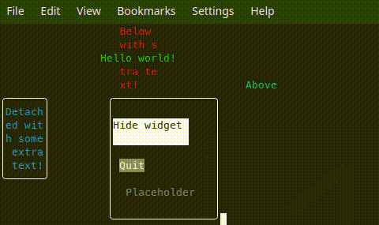
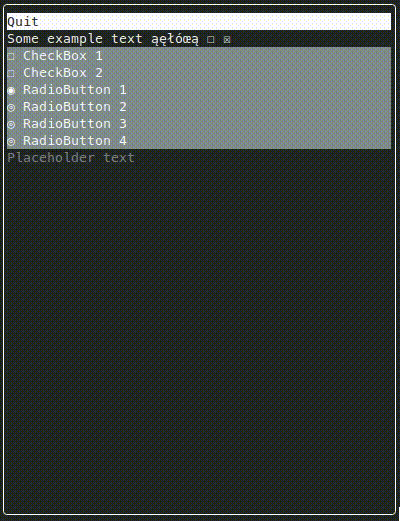

# Terminal GUI

***This project is still pre-alpha***

Set of Qt-based widgets for your terminal! Create textual GUIs in your console
easily.

## Features

* a multitude of widgets (Label, LineEdit, Button, ComboBox, RadioButton, ...)
* layouts (fill, row, column, grid, ...)
* fully dynamic widget properties, with support for signals and slots, 
animations, and other meta-object hight-level control
* custom style support
* convenient and intuitive API
* support for Linux and Windows
* backed by the power of Qt: file access, networking, remote objects,
serial port etc. support

## Builds

What? Builds? Not available yet. It's still a very young project!

## Compile

All that Terminal GUI requires is:
* C++17
* CMake
* QtCore module

By default, TG builds itself as a set of libraries (backend and widgets). It is
easy to link to them (see examples/CMakeLists.txt). If you prefer, you can 
include all the sources in your code, too. The license is *extremely* 
permissive.

## Linux

It just works, and looks great (in terminal emulators) - no worries!

## Windows

Windows has poor UTF-8 support and poor fonts in default `cmd.exe`. Terminal GUI
works but looks worse and is more glitchy than on Linux.

**Recommendation:** use the new Windows Terminal: [link](https://aka.ms/terminal).

Windows PowerShell also seems to work moderately well.

## License

See LICENSE.md - TG is available under WTFPL. It links to Qt, though, so you 
need to keep that in mind.
